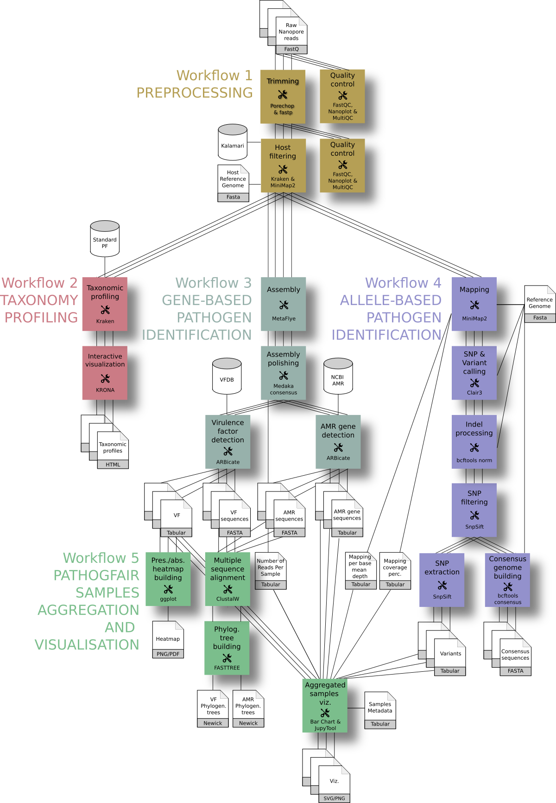

# PathoGFAIR: FAIR and Adaptable Workflows for Pathogen Detection and Tracking

## Overview

Welcome to the GitHub repository for the Foodborne Pathogen Detection and Tracking Project under the fund of [EOSC life industry call 2021](https://www.eosc-life.eu/industrycall/). This project aims to provide a comprehensive solution for the identification and tracking of (foodborne) pathogens using metagenomic (Nanopore) sequencing data. The workflows are developed using Galaxy, an open-source platform for FAIR data analysis.

## Project Structure

- **Workflows:** The core of this project consists of a series of Galaxy-based workflows collectively known as PathoGFAIR. These workflows are designed for processing Nanopore sequencing data, detecting pathogens, and tracking their presence across samples. Workflows are available via the Galaxy Intergalactic Workflow Comission [IWC](https://dockstore.org/organizations/iwc)

	PathoGFair consists of 5 workflows that are created to be scalable to any other type of sequencing technique as well as agnostic such that it can detect all possible pathogens without specifying any pathogen species or giving any information about the input samples to the workflows. The 5 workflows are:

	- **Pre-processing**: where the quality controlling, reads trimming for quality retaining, host sequences removal and other contaminating sequences removal takes place
	- **Taxonomy Profiling**: where taxonomy profiling take place identifying and visualizing our samples' community abundances down to the subspecies level
	- **Gene-based Pathogeneic Identification**: where we identify all possible pathogens by identifying all the Virulence factors (VFs) genes and their specific locations, we also perform more analysis by identifying the MLST scheme for all the samples and the AMR genes
	- **Allele-based Pathogeneic Identification**: where we identify all the SNPs and and create the consensus sequences of all samples
	- **All Samples Analysis**: where we visualize the outputs of the pathogens drawing a heatmap of all the found pathogenic genes for all samples, and phylogenetic trees relating samples together per common pathogenic genes found

- **Training Material:** To assist users in understanding and using the workflows, we have provided extensive training material. This includes tutorials, documentation, and guidelines available via the Galaxy Training Network [GTN](https://bit.ly/pathogen-tuto).

- **Notebooks:** In this repository, you'll find Jupyter notebooks that utilize the output generated by the workflows. These notebooks are designed to help users visualize and analyze the results, producing figures similar to those presented in the associated paper. The notebook is designed to be one of the inputs to Workflow 5 before running the workflow in a Galaxy instance. 

## How to Run the Workflows

- **Galaxy Instance:** You can run the workflows on a Galaxy instance. The workflows are openly available on two workflow registries. You can directly use the European Galaxy server or install them on any other Galaxy server.

- **Data Preparation:** Ensure your data is in the correct format and follows the specified guidelines. Check the training material for details on input requirements.

- **Workflow Execution:** Import the PathoGFAIR workflows into your Galaxy instance and follow the step-by-step instructions provided in the associated training material to execute the workflows on your data.

## Repository Contents

- **Jupter notebooks:** The `bin` directory contains Jupyter notebooks for post-processing and visualization of workflow results.

- **Workflows output datasets:** The `data` directory contains outputs of the workflows after running them on the paper mentioned samples (BioProject PRJNA982679, BioProjects PRJNA942086 and PRJNA942088). The directory also includes the samples metadata.

- **Jupter notebooks results:** The `results` directory contains results after running the Jupyter notebooks on the workflows output datasets.

- **Publication figures:** The `docs/figures` directory contains all figures mentioned in the paper.

- **Publication tables:** The `docs/tables` directory contains all tables mentioned in the paper.

## Contributors

- [Engy Nasr]
- [Anna Henger]
- [Björn Grüning]
- [Paul Zierep]
- [Bérénice Batut]

## Citation

If you use or refer to this project in your research, please cite the associated paper: [Paper Title].

Feel free to contribute, open issues, or provide feedback.
